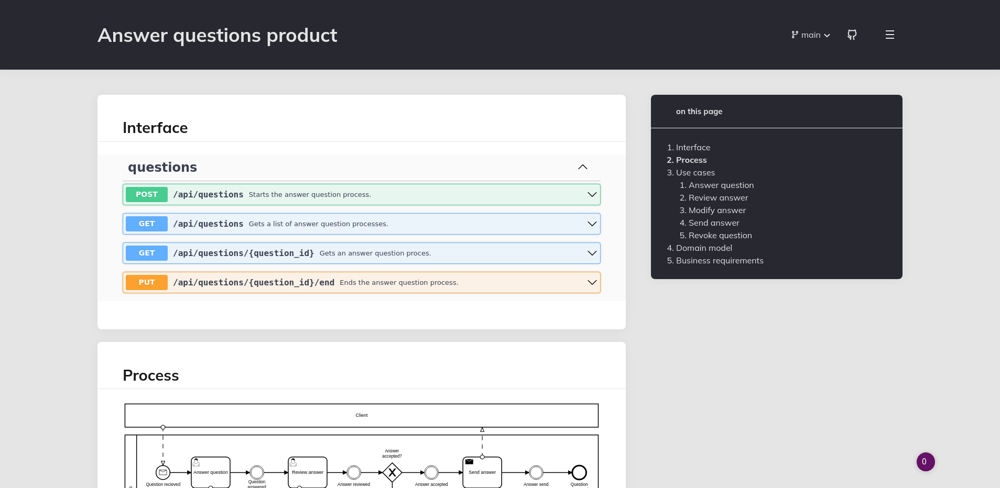

# BizDevOps, aligning business and IT

I see a lot of companies struggling in delivering technical products which meet business expectations. With BizDevOps the goal is to restore the natural order: technical product development driven by business intent.

I have almost twenty years experience in digital product development where I have learned a lot by making mistakes. Over the years I have discovered that some mistakes are more stubborn than others. These mistakes have one thing in common: we failed to deliver what the customer really needed.

Interpretation of an intent is very difficult. First you have to figure out what the real intent is (the question behind the question) and then several people will translate the outcomes into a product. All these layers of translation add to the risk of misinterpretation, which in turn may result in a product which does not meet customer expectation despite all good intentions.

## WHAT vs HOW

When working on technical products the responsibilities within the organization are typically divided between the business (WHAT) and engineering (HOW). To make things work they need to understand each other and accept that there is a natural hierarchy: the business is the customer and engineering the supplier. Therefore the business is in the lead.

This is often not the case in the real world. The business lacks the tools and knowledge to fully communicate their business intent without the need of interpretation by their engineers resulting in endless discussions. Most of these discussions are also HOW related regarding topics like Kafka, Azure, AWS, etc.. Unless you are working at one of these companies these topics are never business related and should not be discussed with business people present. And yes the same applies to our favorite HOW topic of all:  micro services. All these topics are all HOW related implementation details.

I am sure this all sounds familiar, but how do we solve this? The solution is easy when you are working on digital products: enable the business to create the code so that the business intent is clear and does not need interpretation. Asking the business to write code sounds like a lot to ask. But in reality, when using the right tools and with some help from the right people, this is surprisingly easy.

With living documentation engineers only have to focus on the implementation, which is what they excel in. Living documentation is the missing piece in this WHAT vs HOW puzzle.

## Living documentation

With living documentation the business is responsible for documenting its business intent. This documentation is scoped to a business domain. A business domain is a standalone (business) autonomous entity and speaks its own business language. With digital products the anatomy of a business domain is surprisingly uniform:

> A domain delivers one or more products which are consumed via an interface and realized with business processes. Business processes use data to operate and trigger applications to fulfill use cases.

Because these interfaces are business interfaces rather than technical interfaces it is only logical that the business owns them. With living documentation the business is responsible for the documentation of these business interfaces. The engineers use the documented interfaces to generate code. The main living documentation citizens are:
Business processes  in BPMN format;

* Process related user interaction in json schema format;
* Process related commands and queries in openapi format;
* Process related events in asyncapi format;
* Additional process related business requirements in BDD format (given, when, then);

The business process is the most important linking pin between business and engineering:

* It is something that is understood by everyone;
* It gives context to a use case;
* It is free from details enabling high level business discussions;
* You can zoom out to see even more context when the process is part of an end to end process;

The living documentation is written in plain text and maintained in a .git repository. This also makes it possible to work with multiple people on multiple features at the same time. And all changes are tracked automatically. Widely available tooling for merge requests can be used for reviewing and commenting.

The plaint text documentation is automatically transformed into a user friendly website. This website is accessible for the entire organization and shows the current state of the business domain as well as the features being worked on.

Because the living documentation is used by engineering to generate code it is always up to date. The generated code explicitly communicates business intent and business language: fully aligning business and engineering.

To successfully implement BizDevOps and living documentation business and engineering must embrace these new WHAT vs HOW boundaries and accept thier new responsibilities.

A BizDevOps coach can help the organization with this transition. This person is someone who understands business as well as engineering and can operate on all levels in the organization. This person has a cross domain scope and therefore is able to challenge decisions and is able coach business as well as engineering.

## Closing notes

With BizDevOps and living documentation anyone who wants to change the WHAT is forced to request the business for a change. In my experience these requests for change are the most interesting- and crucial moments in the BizDevOps lifecycle. This is when the right discussions, all related to WHAT, take place with the right people and often result in a surprising outcome.

With the strict separation between WHAT and HOW I am not suggesting to lockout engineering from the business cycle. This blog is all about ownership, responsibilities and context. Everyone needs to be aware of this when engaging in a discussion.

[Follow me on LinkedIn](https://www.linkedin.com/in/arjan-geertsema-051ab66/) to be notified about an upcoming webinar regarding BizDevOps.

I love getting your feedback, send me [an email](mailto:arjan@synion.nl).

Need help with implementing BizDevOps in your organization? [Reach out to me](mailto:arjan@synion.nl), maybe I can help!

Thank you Bernd Rücker and Cyrille Martraire for sharing your inspirational thoughts regarding BizDevOps and living documentation.