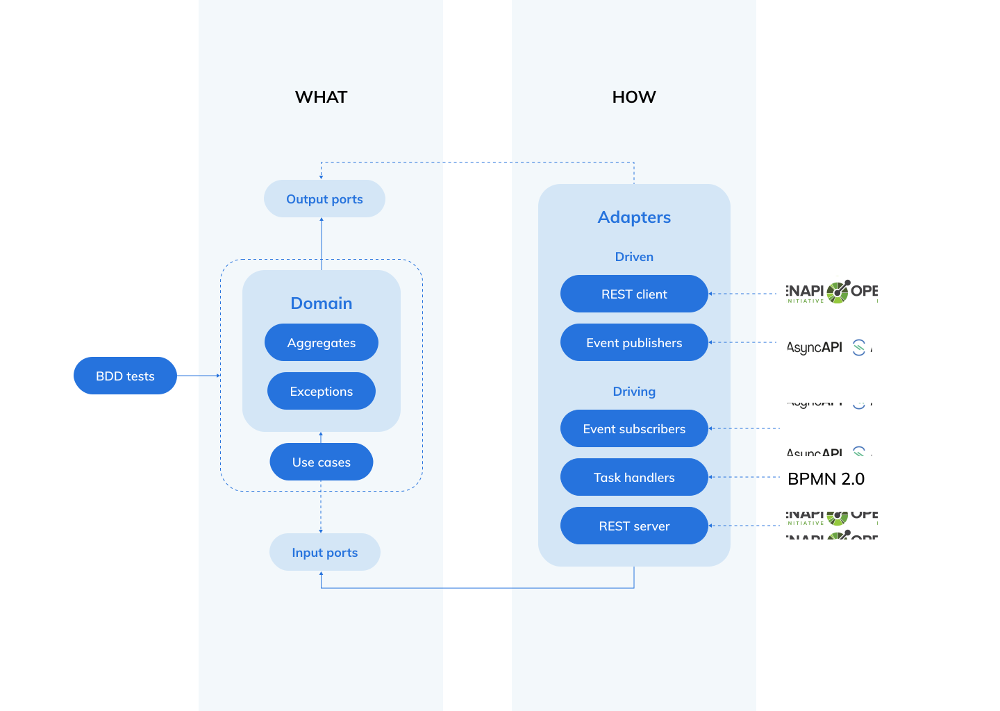

# BizDevOps: align business and IT

> A lot of companies are struggling in delivering technical products which meet business expectations. With BizDevOps the goal is to restore the natural order: technical product development driven by business intent.

## WHAT vs HOW

When working on technical products the responsibilities within the organization are typically divided between the business (WHAT) and engineering (HOW). To make things work they need to understand each other and accept that there is hierarchy: the business is in the lead because they sell the products which pay for the bills.

This is often not the case in the real world because the business lacks the tools and knowledge to fully communicate there business intent without the need of interpretation by their engineers. Often the business also lacks mandate which disrupts the natural hierarchy. As a result, HOW discussions are conducted over WHAT with the presence of the business and development is carried out without an underlying business requirement.

This is al sounds to familiar, but how do we solve this? The solution is easy when you are working on digital products: enable the business to create code so that the business intent is clear and does not need interpretation. In this way the engineers only have to focus on the implementation, which is what they excel in. Living documentation is the missing piece in this WHAT vs HOW puzzle.

---

## Living documentation

The business is organized in business domains. A business domain is a standalone (business) autonomous entity. A domain owns and delivers one or more products. With digital products the anatomy of a domain is surprisingly uniform:

> A domain delivers one or more products which are consumed via an interface and realized with business processes. Business processes use data to operate and trigger applications to fulfill use cases.

With living documentation the business owns its business interfaces and therefore is responsible for the entire lifecycle. These interfaces are the digital assets which are used by the engineers to generate code:
Business processes  in BPMN format;

* Process related user interaction in UI/UX specification or meta format;
* Process related commands and queries in openapi format;
* Process related events in asyncapi format;
* Additional process related business requirements in BDD format (given, when, then);

The living documentation is maintained in a .git repository. Because the documentation is written in plain text .git tooling for merge requests can be used for review and comment on changes. Every change (commit) will automatically start a process which transforms the plaint text documentation into a user friendly website. This website is accessible for the entire organization and shows the current state of the domain as well as the features being worked on.

Because the living documentation is used by engineering to generate code it is always up to date. The generated code explicitly communicates business intent and -language which will automatically lead to the creation of right business use cases.

---

## Business driven software architecture

For the engineers it al boils down to implementing the business intent which has been documented in the living documentation. To fully embrace this API first business driven software development mindset you need a software architecture which embraces change and is focused on the business domain.

@Alistair Cockburn's [hexagonal architecture](https://en.wikipedia.org/wiki/Hexagonal_architecture_(software)) and @Robert Martin's [clean architecture](https://blog.cleancoder.com/uncle-bob/2012/08/13/the-clean-architecture.html) are software architectures which exactly do that. They both put the business domain in the center and externalize infrastructure and frameworks with dependencies pointing outwards. With hexagonal architecture ports are used to invert dependencies making the domain independent of all other components: 

* There are input ports (driving ports) which drive the domain: they are used by adapters and are implemented as use cases. 
* There are output ports (driven ports) which are driven by the domain: they are used in the domain and implemented by adapters.

This results in the following layers:

* The business domain, exposing only port interfaces and has no dependencies and is responsible for implementing the input ports (use cases);
* The adapters, which have a dependency with the business domain and specific external frameworks and are responsible for implementing output ports;
* An application, which has dependencies with the business domain and the adapters and is responsible for configuration and dependency injection;

The domain and the port interfaces are all business related and define the WHAT and are owned by the business. The adapters are implementations of output ports and consumers of use cases and define the HOW and are owned by the engineers.

---

## Generate the code

The adapters are organized around infrastructure and frameworks. With code generation it is possible to transform living documentation assets into specific adapter implementations:

* bpmn adapter: generated process task handlers execute use cases and process related output ports are implemented to work with the workflow engine API;
* async-api adapter: generated event subscribers execute use cases and event related output ports are implemented to trigger generated event publishers;
* openapi adapter: generated rest servers execute use cases and API related output ports are implemented to work with generated API clients;

---

## Closing notes

With BizDevOps and living documentation anyone who wants to change the WHAT is forced to request the business for a change. In my experience these requests for change are the most interesting- and crucial moments in the BizDevOps lifecycle. This is when the right discussions, all related to WHAT, take place with the right people and often result in a surprising outcome.

With the strict separation between WHAT and HOW I am not suggesting to lockout engineering from the business cycle. This blog is all about ownership, responsibility and context. When the business is present the context is always about WHAT and never about HOW.

[Follow me on LinkedIn](https://www.linkedin.com/in/arjan-geertsema-051ab66/) to be notified about an upcoming webinar regarding BizDevOps.

I love getting your feedback. Please [send me an email](mailto:arjan@synion.nl).

Need help with implementing BizDevOps in your organization? [Reach out to me](mailto:arjan@synion.nl), maybe I can help!

And thank you @Bernd Rücker, @Alistair Cockburn, @Robert Martin and @Jan Stenberg for sharing your inspirational thougts.